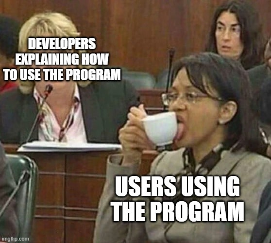

## Hi there 👋 I'm Rohit Kumar!

Passionate about web development, traveling, and exploring new technologies.

### 🌟 About Me:
- 🔭 Currently working on **Front-End and Back-End Web Development**.
- 🌱 Learning **C#, ASP.NET, SQL, and advanced JavaScript**.
- 🎨 Designing interactive user experiences with **Figma**.
- 🌍 Dreaming of visiting **Japan** and **Norway**.
- 📚 Exploring **interaction design** and **voice user interfaces**.

### 💡 What I Do:
- 👨‍💻 Build responsive, interactive web applications.
- 🗂 Develop **data-driven websites** with SQL and C#.
- ✍️ Create accessible and aesthetic web designs.

### 📫 Connect with Me:
- [LinkedIn](https://www.linkedin.com/in/rohit-kumar-80757a163/)  
- [Anime Suggestion Website]([https://famous-squirrel-5d5ef7.netlify.app/](https://rohitsinghgrover.com/AnimeSuggestion/))  

---

### 😂 Meme Time:

---

⚡ Fun Fact: When I'm not coding, I’m planning travel adventures or watching anime for inspiration! 🎒✈️

Thanks for stopping by! 🚀
